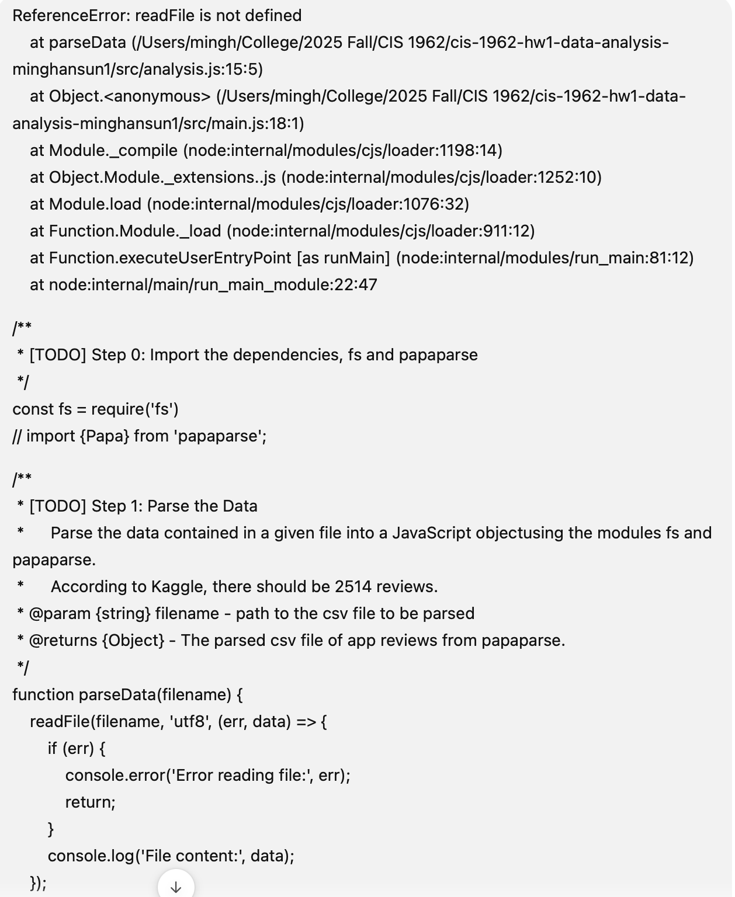
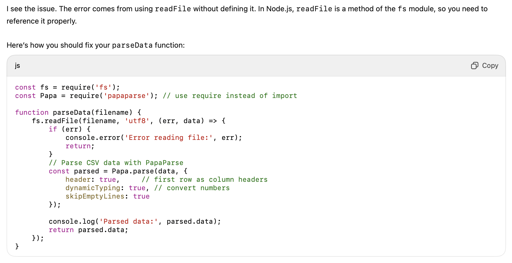
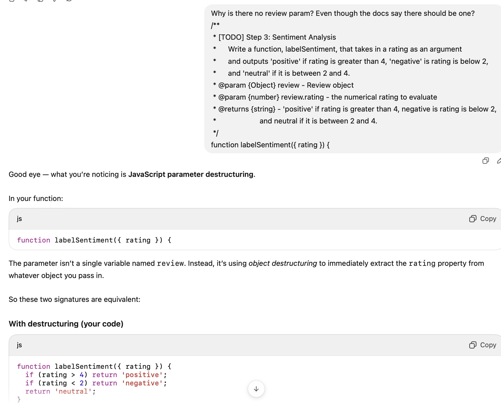
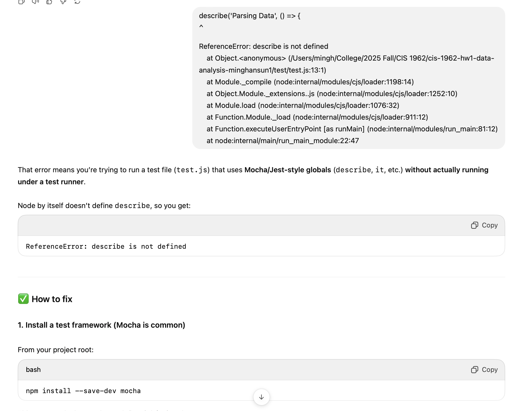

# Homework 1 AI Synthesis Activity

Only complete one of the assignments below! You can delete the other assignment in this document once you've made your choice.

## Activity: You used AI

### Part 1

> Cite the usage by including screenshots, a text transcript, or a link to the conversation with your AI of choice. Make sure to include any context, instructions, and all the conversations you had with the AI.

### Part 2

> Write about why you used AI. Was there a gap in knowledge you wanted to fill? Were the answers through traditional search engines not adequate? Did you want to let AI help you format something in a quick manner?

I used AI mostly for small language-specific points of confusion I had.
I was pretty busy this week so I didn't have too much time to study everything in depth. I think that I could've found the information I need through traditional search engines, but it would've taken a lot longer.

### Part 3

> Evaluate the AI's response. If you asked multiple questions, you can pick one of the responses the AI generated. Does the AI answer your question properly? Does it hallucinate any details? Could there be room to improve this response through manual editing? Did you accept this response fully or adapt parts of it into your work?

The AI responses all seemed pretty good. It just told me that the issue of the test file failing was because I didn't install mocha yet. Once I did that it worked. I fully accepted this response, since it fixed the issue I was facing.

### Part 4

> If you used unfamiliar syntax or concepts generated by AI within your assignment, be sure to research them and explain what those concepts are to demonstrate your understanding.

For the first AI response I used, I learned that I needed to include the package name before the method that I was calling from that package.

For the second AI response I used, I was reminded about how object destructuring works. It basically just uses brackets to extract the fields in the brackets from the object.

For the third AI response I used, I learend that I need to install mocha before I run unit tests in Javascript.

---

## Activity B: You did NOT use AI

### Part 1

> Explain some improvement you want to make within your code. Perhaps you have a code block that could be more concise, or a part of your code could be improved with a library or be performed with a more efficient algorithm.

### Part 2

> Ask AI how to improve your code, by picking a part of your program you are interested in improving and asking something along the lines of "how can I improve this code?" This does not have to be verbatim; you could ask more specific questions for improvement, like "what JavaScript libraries could improve the efficiency of my code?" Screenshot or link the response.

### Part 3

> Evaluate the response the AI generates. You may need to do some research to do this evaluation, to see if the syntax generates correctly or if any libraries the AI suggests are appropriate for the current task. Report on whether the AI's solution fits within your project, or if it would need modifications to work properly.

**_ You do NOT need to use the AI suggestion within your final submission, if your code already works properly. If the scope of your inquiry in this activity leads you to replace parts of your code, switch to the other version of this activity instead. _**
